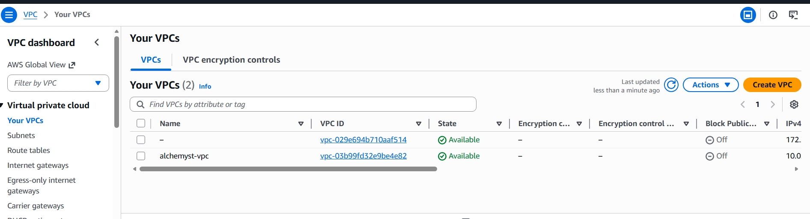
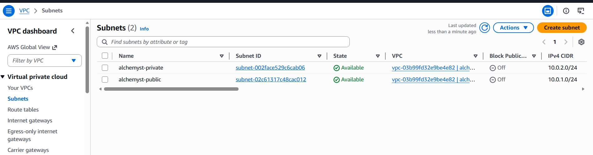
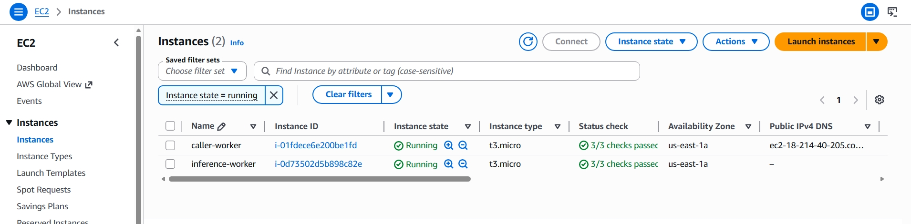

# AlchemystAI DevOps Assignment - Arnav Verma

This is my submission for the DevOps internship assignment.
I'll walk through what I built, what didn't work and why,
and what I'd do differently with more time.

## What I Built

The goal was to deploy two workers across two VMs where
the inference worker sits in a private subnet and the caller
worker handles public traffic.

- Created a VPC on AWS with a public and private subnet
- caller-worker runs on the public EC2 (port 8080) -
  this is the only thing the internet can reach
- inference-worker runs on the private EC2 (port 5000) -
  no public IP, only reachable from the caller
- Wrote all the infrastructure in Terraform so it can be
  torn down and rebuilt cleanly

## Architecture
Internet
   |
   v
Public Subnet (10.0.1.0/24)
caller-worker EC2 - public IP, port 8080
   |
| HTTP call over private network
   v
Private Subnet (10.0.2.0/24)
inference-worker EC2 - no public IP, port 5000

## The iii-sdk Problem

I spent a good amount of time trying to get the iii framework
running before realizing it wasn't going to work on t3.micro.

Two blockers I hit:
1. iii needs KVM to run worker sandboxes - t3.micro doesn't
   have /dev/kvm so the worker just kept failing to start
2. iii-sdk isn't on public PyPI. Tried their private registry
   at pypi.iii.dev but the SSL certificate had expired so
   pip couldn't install it either

After debugging this for a while I decided to implement the
same architecture using Flask instead - same two VMs, same
network setup, same request flow from internet through the
caller to the inference worker. The only difference is I'm
not using the iii RPC layer.

## How to Run This

You'll need AWS CLI set up, Terraform installed, and an
SSH key at ~/.ssh/id_rsa.

**Spin up the infrastructure:**
```bash
cd terraform_scripts
terraform init
terraform apply
```

Terraform will output two IPs - save them:
- caller_public_ip (this is what you'll hit with curl)
- inference_private_ip (this is the private address)

**Set up the inference worker (private VM):**
```bash
# first copy your SSH key to the caller VM
scp -i ~/.ssh/id_rsa ~/.ssh/id_rsa ec2-user@<caller_public_ip>:~/.ssh/id_rsa

# SSH into caller VM
ssh -i ~/.ssh/id_rsa ec2-user@<caller_public_ip>

# from caller VM jump into the private inference VM
ssh -i ~/.ssh/id_rsa ec2-user@<inference_private_ip>

# install and run inference worker
pip3 install flask
curl -O https://raw.githubusercontent.com/Arnav2354/Arnav_AlchemystAI_Submission/main/workers/inference-worker/inference_app.py
python3 inference_app.py &
```

**Set up the caller worker (public VM):**
```bash
pip3 install flask requests
curl -O https://raw.githubusercontent.com/Arnav2354/Arnav_AlchemystAI_Submission/main/workers/caller-worker/caller_app.py
INFERENCE_HOST=<inference_private_ip> python3 caller_app.py &
```

**Test it:**
```bash
curl -X POST http://<caller_public_ip>:8080/v1/chat/completions \
  -H "Content-Type: application/json" \
  -d '{"messages": [{"role": "user", "content": "hello"}]}'
```

## Screenshots

### VPC


### Subnets


### EC2 Instances Running


## What I'd Harden Before Production

Honestly the current setup is pretty bare - here's what
I'd change before putting this anywhere near production:

- swap Flask dev server for gunicorn
- put HTTPS in front of the public endpoint
- lock SSH down to specific IPs instead of 0.0.0.0/0
- add CloudWatch logs so you can actually debug things
- put an ALB in front of the caller worker
- use IAM instance roles properly instead of passing keys around
- health check endpoints on both workers

## What I'd Do Differently at 100x Model Size

At that scale the inference worker becomes the bottleneck:

- need GPU instances (g4dn.xlarge or p3 to start)
- store model weights on S3 instead of local disk
- put an internal load balancer in front of multiple
  inference workers
- add SQS between caller and inference so you don't drop
  requests under load
- EKS for orchestrating the inference tier
- spot instances for inference to keep costs down

## Server Restart

Right now both workers run as background processes with &
so they die on restart. In production I'd use systemd:

```bash
# /etc/systemd/system/inference-worker.service
[Unit]
Description=Inference Worker
After=network.target

[Service]
ExecStart=/usr/bin/python3 /home/ec2-user/inference_app.py
Restart=always
User=ec2-user

[Install]
WantedBy=multi-user.target
```

Then just systemctl enable inference-worker and it
comes back up automatically on reboot.

## Note

Took down the live deployment after testing to avoid
burning through AWS credits (NAT Gateway adds up fast).
terraform apply brings everything back up in about 5 minutes.
